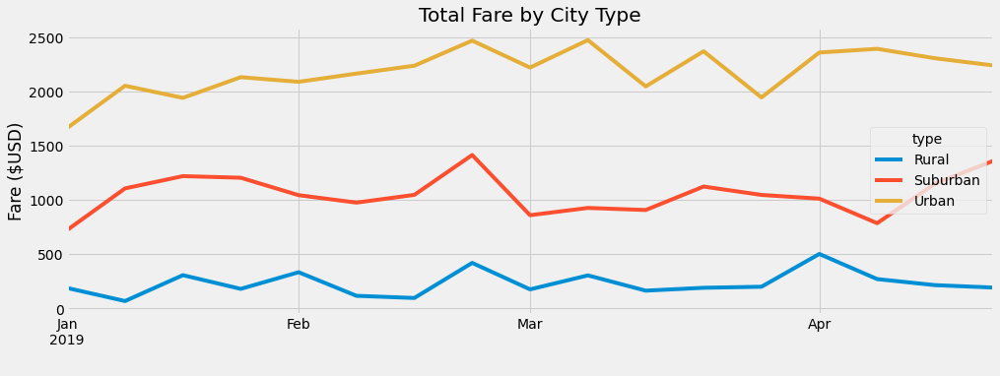

# PyBer Analysis

## Overview

The purpose of this analysis was to perform an exploratory analysis on PyBer 2019 ride-sharing data.  By writing python scripts using pandas libraries, the Jupyter notebook, and Matplotlib, I analyzed and visualized the data to create charts that showcase the relationship between:
• Type of city, and the number of drivers and riders
• The percentage of total fares, riders, and drivers by type of city.

The analysis and visualizations with help PyBer improve access to ride-sharing services and determine affordability for underserved neighborhoods.

## Results

 Based on the analysis of the city type in regards to rides, drivers, and fares, we can conclude that urban city types are more populated based on the amount of total drivers and total rides that are reported for those city types. The total fares is also higher for the urban city type, than any other city type.  
	
Based on the average fare per driver and average fare per ride, the rural city type has higher pricing in comparison to the other city types. This can be due to the fact that there are fewer drivers available within those city types. 
	
Between January and April of 2019, the total fare by city type peaked for for both rural and suburban city types around the end of February. The urban city types did not peak until April.  

## Summary

In conclusion, we can see that there is a correlation in the amount of drivers available and the average fare for each city type. City types with less drivers available cost more per ride verse city types with more drivers available. 
	
### Recommendations

- Offer drivers incentives to take rides outside of there general area, this will increase the avilablity of drivers bringing down the cost per ride for customers. This could also eliminate competition by having more availbilty and lower cost in underserve areas.
- Charge more per ride in urban cities to match the earns for each city type driver.
- Increase prices during high demanding times, like rush hour or during peak weeks.
